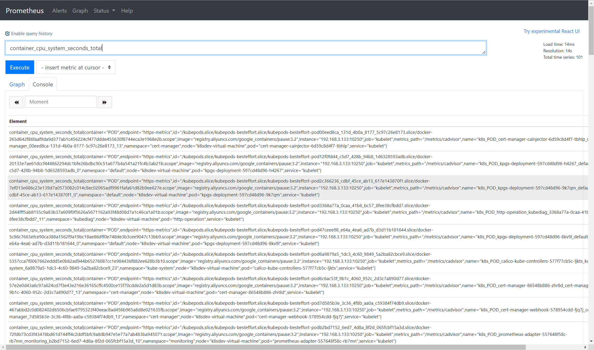
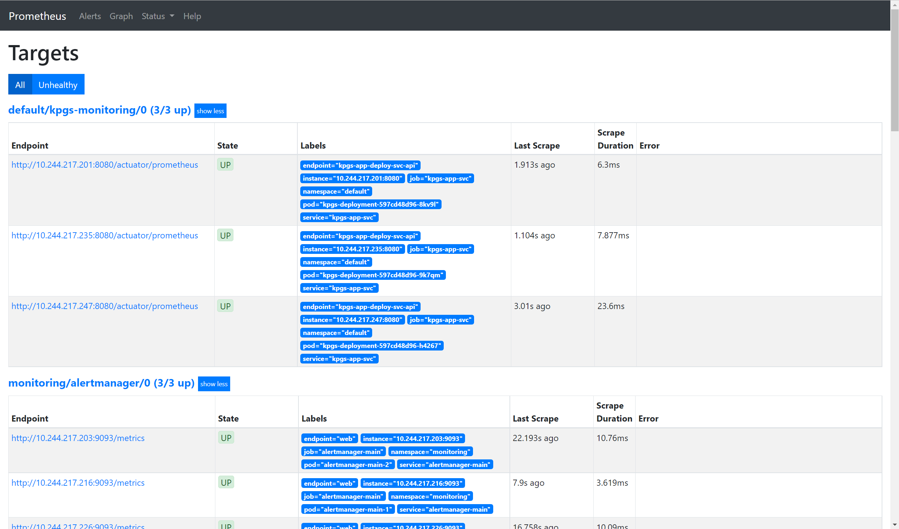
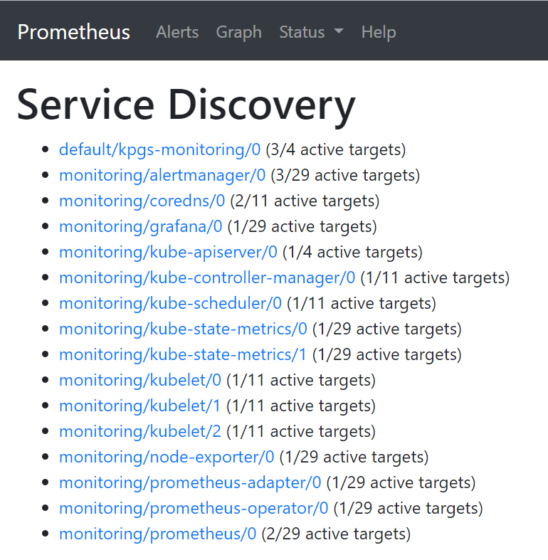
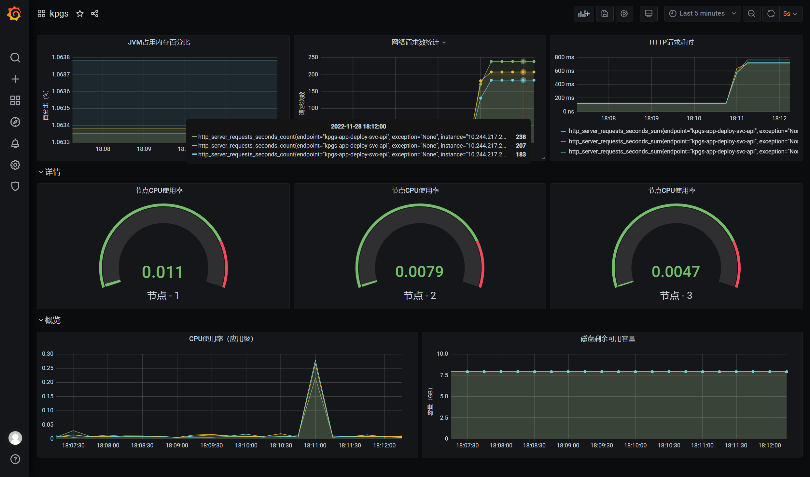

# 概述
## 准备
该实践应用于以下环境：
- Ubuntu：22.04
- Kubernetes：v1.19.0
- kube-prometheus：v0.6.0
- Docker：20.10.21
## 达成
该项目达到的工作流为：
1. 使用SpringBoot开发完成Web应用后，打包Docker镜像。
2. 在Kubernetes中创建Deployment、Service资源，部署Web应用。
3. 在Kubernetes中创建ServiceMonitor资源，让Prometheus自动嗅探到可探测资源的更改，并添加到监控列表中。
4. 在Prometheus中使用PromQL语言进行查询和分析。
5. 使用Grafana对接Prometheus数据源，并创建监控面板。
# 具体步骤
## 准备Kubernetes并验证
具体步骤可参考【[记一次Kubernetes实践](https://mp.weixin.qq.com/s?__biz=Mzg2OTQzMzk3OQ==&mid=2247484534&idx=1&sn=e08fba77e65a32f50023ea73d60764ae&chksm=ce9c5362f9ebda74af9287ba19315b83853a9847b85e5d03704cc37577228e1b977423631aa5#rd)】一文，完成后一定要进行验证，确保Kubernetes是正常工作的。
## 准备kube-prometheus并验证
对于Kubernetes中的Prometheus而言，目前应用最为广泛的是使用Prometheus-Operator进行自动化的安装与配置，避免大量的手动配置，也就避免了很多不经意的错误。可以从以下官网查看具体信息。
```text
https://github.com/prometheus-operator/kube-prometheus/
```

对于Kubernetes整个生态圈，个人感受里第一个最深的就是版本之间的耦合较为严重，各个组件不同版本之间存在不兼容的现象，所以一定要确保自己的Kubernetes环境下需要什么版本的kube-prometheus，以下两个表来自kube-prometheus官方文档中，基本覆盖了当前较为广泛使用的Kubernetes版本，因此列出来作为参考。
| kube-prometheus stack | Kubernetes 1.14 | Kubernetes 1.15 | Kubernetes 1.16 | Kubernetes 1.17 | Kubernetes 1.18 | Kubernetes 1.19 |
|-----------------------|-----------------|-----------------|-----------------|-----------------|-----------------|-----------------|
| `release-0.3`         | ✔               | ✔               | ✔               | ✔               | ✗               | ✗               |
| `release-0.4`         | ✗               | ✗               | ✔ (v1.16.5+)    | ✔               | ✗               | ✗               |
| `release-0.5`         | ✗               | ✗               | ✗               | ✗               | ✔               | ✗               |
| `release-0.6`         | ✗               | ✗               | ✗               | ✗               | ✔               | ✔               |

| kube-prometheus stack                                                                      | Kubernetes 1.20 | Kubernetes 1.21 | Kubernetes 1.22 | Kubernetes 1.23 | Kubernetes 1.24 |
|--------------------------------------------------------------------------------------------|-----------------|-----------------|-----------------|-----------------|-----------------|
| `release-0.8`   | ✔               | ✔               | ✗               | ✗               | ✗               |
| `release-0.9`  | ✗               | ✔               | ✔               | ✗               | ✗               |
| `release-0.10` | ✗               | ✗               | ✔               | ✔               | ✗               |
| `release-0.11` | ✗               | ✗               | ✗               | ✔               | ✔               |
| [`main`](https://github.com/prometheus-operator/kube-prometheus/tree/main)                 | ✗               | ✗               | ✗               | ✗               | ✔               |

这里使用的是Kubernetes版本是v1.19.0，因此选择一个匹配程度较好的kube-prometheus版本：v0.6。
### 安装Kubernetes中的Prometheus
```bash
# 下载源码
wget https://github.com/prometheus-operator/kube-prometheus/archive/refs/tags/v0.6.0.tar.gz 

# 解压软件到当前目录下
tar -zxvf ./v0.6.0.tar.gz 

# 进到软件目录下，准备安装
cd kube-prometheus-0.6.0/
```
等待解压完成后，需要修改以下默认的配置文件，来让自己用起来更加方便。举个例子：如果不修改的话，Kubernetes会随机为Prometheus、AlertManager、Grafana分配一个端口，这样一来就需要每次查询 `kubectl get svc -n monitoring` 来查看对应服务的端口是什么，如果有防火墙的话， 还得打开对应端口才能正常使用。
具体的修改如下：
打开 `manifests/prometheus-service.yaml` 修改为 `NodePort`，并添加端口号
```
apiVersion: v1
kind: Service
metadata:
  labels:
    prometheus: k8s
  name: prometheus-k8s
  namespace: monitoring
spec:
  type: NodePort
  ports:
  - name: web
    port: 9090
    targetPort: web
    nodePort: 30200
  selector:
    app: prometheus
    prometheus: k8s
  sessionAffinity: ClientIP
```
打开 `manifests/alertmanager-service.yaml` 修改为 NodePort，并添加端口号
```text
apiVersion: v1
kind: Service
metadata:
  labels:
    alertmanager: main
  name: alertmanager-main
  namespace: monitoring
spec:
  type: NodePort
  ports:
  - name: web
    port: 9093
    targetPort: web
    nodePort: 30300
  selector:
    alertmanager: main
    app: alertmanager
  sessionAffinity: ClientIP
```
打开 `manifests/grafana-service.yaml` 修改为 `NodePort` 并添加端口号
```text
apiVersion: v1
kind: Service
metadata:
  labels:
    app: grafana
  name: grafana
  namespace: monitoring
spec:
  type: NodePort
  ports:
  - name: http
    port: 3000
    targetPort: http
    nodePort: 30100
  selector:
    app: grafana
```
这样一来，通过 `IP:30100` 就可以直接访问 Grafana，通过 `IP:30200` 就可以直接访问 Prometheus，通过 `IP:30300` 可以直接访问 AlertManager组件。
以下步骤假设Kubernetes的环境已经配置完成，并且所有Kubernetes相关的系统资源都正常，并完成了相关的配置。
```bash
kubectl create -f manifests/setup
# 等待所有资源完成配置
until kubectl get servicemonitors --all-namespaces ; do date; sleep 1; echo ""; done

kubectl create -f manifests/
```
等待所有Pod状态变成 `Running` 即可，如果有异常可以看下面章节的【可能出现的问题】中有没有类似的问题。
```bash
kubectl get pods -n monitoring
NAME                                   READY   STATUS    RESTARTS   AGE
alertmanager-main-0                    2/2     Running   18         6d4h
alertmanager-main-1                    2/2     Running   18         6d4h
alertmanager-main-2                    2/2     Running   18         6d4h
grafana-7c9bc466d8-zc8z9               1/1     Running   4          33h
kube-state-metrics-66b65b78bc-fgshl    3/3     Running   30         6d4h
node-exporter-xqj84                    2/2     Running   22         6d4h
prometheus-adapter-557648f58c-rb7mn    1/1     Running   10         6d4h
prometheus-k8s-0                       3/3     Running   36         6d4h
prometheus-k8s-1                       3/3     Running   36         6d4h
prometheus-operator-5b7946f4d6-s88f7   2/2     Running   8          33h
```
### 验证Kubernetes和Prometheus是否正常工作
等待所有Pod跑起来后，就可以去主机上访问对应的服务了，这里进行一个简单的容器CPU负载查询，可以看到是正常获取的。

如果没有正常获取到，可以去Target目录下看看是哪个目标没挂载或者不健康了，从而进一步排查问题，一定要确保所有监控对象是Healthy的，因为这里还没有部署其他应用，所以如果出现了Unhealthy，那么一定是关键必要组件出现了异常，是必须解决的。

## 准备SpringBoot应用
这里仍然参考【[记一次Kubernetes实践](https://mp.weixin.qq.com/s?__biz=Mzg2OTQzMzk3OQ==&mid=2247484534&idx=1&sn=e08fba77e65a32f50023ea73d60764ae&chksm=ce9c5362f9ebda74af9287ba19315b83853a9847b85e5d03704cc37577228e1b977423631aa5#rd)】中提到的SpringBoot应用，只不过这里额外添加了以下有关Prometheus的依赖和配置
### 添加Prometheus相关的依赖
```xml
<dependency>  
   <groupId>org.springframework.boot</groupId>  
   <artifactId>spring-boot-starter-actuator</artifactId>  
</dependency>  
<dependency>  
   <groupId>io.micrometer</groupId>  
   <artifactId>micrometer-registry-prometheus</artifactId>  
   <scope>runtime</scope>  
</dependency>
```
### 增加Prometheus配置
```properties
spring.application.name=k8s-helloworld  
management.endpoints.web.exposure.include=*
```
完成以上依赖和配置后，SpringBoot已经提供了通用的Actuator和Prometheus数据转换器功能，通过以下可以验证：
```bash
curl -X GET http://localhost:8080/actuator/prometheus

# HELP jvm_gc_pause_seconds Time spent in GC pause
# TYPE jvm_gc_pause_seconds summary
jvm_gc_pause_seconds_count{action="end of minor GC",cause="Metadata GC Threshold",} 1.0
jvm_gc_pause_seconds_sum{action="end of minor GC",cause="Metadata GC Threshold",} 0.006
# HELP jvm_gc_pause_seconds_max Time spent in GC pause
# TYPE jvm_gc_pause_seconds_max gauge
jvm_gc_pause_seconds_max{action="end of minor GC",cause="Metadata GC Threshold",} 0.006
...
jvm_memory_used_bytes{area="nonheap",id="CodeHeap 'non-profiled nmethods'",} 7212288.0
```
如果得到类似的结果，说明Prometheus在SpringBoot中已经正常工作了，这时候只需要打包到Docker仓库中，然后创建Kubernetes对应的资源就可以验证是否在系统中正常工作了。
### 创建Kubernetes中的应用集群
这里为了方便，将该Web应用命名为kpgs（**K**ubernetes **P**rometheus **G**rafana **S**pringBoot）并直接提供资源配置文件：
```yaml
# kpgs.yaml
---  
apiVersion: apps/v1  
kind: Deployment  
metadata:  
  name: kpgs-deployment  
spec:  
  replicas: 3  
  selector:  
    matchLabels:  
      app: kpgs-app  
  template:  
    metadata:  
      labels:  
        app: kpgs-app  
    spec:  
      containers:  
        - name: kpgs-docker  
          image: k8s-docker:0.0.1-SNAPSHOT  
          imagePullPolicy: Never  
          ports:  
            - name: http  
              containerPort: 8080  
  
---  
apiVersion: v1  
kind: Service  
metadata:  
  name: kpgs-app-svc  
  labels:  
    app: kpgs-app-deploy-svc  
spec:  
  type: NodePort  
  selector:  
    app: kpgs-app  
  ports:  
    - name: kpgs-app-deploy-svc-api  
      port: 8080  
      nodePort: 30888
```
然后应用该资源：
```bash
kubectl apply -f ./kpgs.yaml

kubectl get pods
NAME                               READY   STATUS    RESTARTS   AGE
kpgs-deployment-597cd48d96-8kv9l   1/1     Running   0          3h3m
kpgs-deployment-597cd48d96-9k7qm   1/1     Running   0          3h3m
kpgs-deployment-597cd48d96-h4267   1/1     Running   0          3h3m

kubectl get deployment
NAME              READY   UP-TO-DATE   AVAILABLE   AGE
kpgs-deployment   3/3     3            3           3h4m
```
### 验证是否正常工作
```bash
curl -X GET http://192.168.3.133:30888/

ID: 42d2e73b-88d8-40f0-b7f5-50896ab67685 hello, world!, properties: root@kpgs-deployment-597cd48d96-h4267
```
截至目前，一切OK🆗~
## 连接Kube-Prometheus和Web应用
此时Kube-Prometheus还不知道需要监控该Web应用，也不知道怎样监控他，这时就体现了 `ServiceMonitor` 资源的重要性了，创建一个 `kpgs-monitor.yaml` 文件，来放到Kubernetes中：
```yaml
# kpgs-monitor.yaml
apiVersion: monitoring.coreos.com/v1  
kind: ServiceMonitor  
metadata:  
  name: kpgs-monitoring  
  labels:  
    app: kpgs  
spec:  
  endpoints:  
    - port: kpgs-app-deploy-svc-api # 这里一定要和被监控的Service的Port对应
      interval: 5s  
      scheme: http  
      path: '/actuator/prometheus'  
  selector:  
    matchLabels:  
      app: kpgs-app-deploy-svc # 这里对应被监控Service的label
```
将该 `ServiceMonitor` 资源放到 Kubernetes 中来：
```bash
kubectl apply -f ./kpgs-monitor.yaml

kubectl get servicemonitor
NAME              AGE
kpgs-monitoring   3h11m
```
略微等那么几秒钟，然后去 Prometheus 主面板上看对应的监控服务是否配置妥当，Prometheus在之前的配置是：`http://192.168.3.133:30200`，打开后查看 `Status/Service Discovery` 下的资源：

到这一步，主要依赖的是服务的自动发现技术，可以看到第一个即是待监控的资源，并且没有异常情况。
执行一个PromQL查询一下当前CPU使用率：
```bash
process_cpu_usage{job="kpgs-app-svc"}
```
|Element|Value|
|---|---|
|process_cpu_usage{endpoint="kpgs-app-deploy-svc-api",instance="10.244.217.201:8080",job="kpgs-app-svc",namespace="default",pod="kpgs-deployment-597cd48d96-8kv9l",service="kpgs-app-svc"}|0.016877637130801686|
|process_cpu_usage{endpoint="kpgs-app-deploy-svc-api",instance="10.244.217.235:8080",job="kpgs-app-svc",namespace="default",pod="kpgs-deployment-597cd48d96-9k7qm",service="kpgs-app-svc"}|0.01834862385321101|
|process_cpu_usage{endpoint="kpgs-app-deploy-svc-api",instance="10.244.217.247:8080",job="kpgs-app-svc",namespace="default",pod="kpgs-deployment-597cd48d96-h4267",service="kpgs-app-svc"}|0|
这里最后一个实例为0是因为在之前的测试中，Kubernetes并没有把对应的cURL请求落在该实例上，后面还会进行大批量的测试，来验证Prometheus的统计数据是否准确。
## 连接Grafana和Prometheus
老生常谈的东西了，使用默认admin-admin账号登录Grafana之后，配置数据源，不过这里的数据源配置起来不太一样。
Kubernetes为了更灵活的配置，Kube-Prometheus更是为了灵活，采用了直接使用内部域名绑定IP的方式进行：
```text
# Grafana中的Prometheus数据源
http://prometheus-k8s.monitoring.svc:9090
```
完成后测试保存，即可进行配置Dashboard，后面会展示Dashboard面板。
## 验证Prometheus统计数据是否完整
结论其实毋庸置疑，肯定是准确的。之所以会有这个环节，是因为之前一个错误的使用方法引起了我的思考。
### 一个错误的例子
使用外部单独安装的Prometheus，这时直接配置 `prometheus.yml` 文件中的 `job` 并重启，例如下面：
```yaml
- job_name: 'kpgs-demo'
    metrics_path: '/actuator/prometheus'
    scrape_interval: 5s
    static_configs:
      - targets: ['192.168.3.133:30888']
```
但是这样有一个问题，一个Deployment里可以定义多个Pod资源副本，那么每个Pod中是有一个kpgs应用软件的，我在Prometheus中查询CPU使用率时，怎么知道查询的是哪一个Pod中的呢？甚至当Pod分布在不同Node上时，怎样知道是查询的哪个Node呢？还是说计算的是总和？
经过验证发现，这个查询是随机一个Pod中的，当Deployment只有一个Pod副本声明时这个方法没有什么问题，但是当多了之后，就有问题了，因为只能知道一个Pod实例的情况，其他是没办法知道的。
但是在本文前面部分提到的方法，是没有这个问题的，因为可以指定查询的具体实例，甚至可以聚合查询。
### Grafana中记录cURL请求次数
执行请求的脚本和之前一样，如下：
```python
import requests  
  
  
def func():  
    url = "http://192.168.3.133:30888"  
    count = dict()  
    for i in range(0, 600):  
        res = requests.get(url)  
        host = res.text.split("@")[1]  
        if count.__contains__(host):  
            count[host] = count.__getitem__(host) + 1  
        else:  
            count[host] = 1  
    print(count)  
  
  
if __name__ == '__main__':  
    func()
```
这里我配置的是如下面板，可以看到三个节点加起来的请求总数是238+207+183=628次。

之所以多出来28个请求，是因为在之前的测试中用过了，如下：

因此减去多出来的这28个之后，正好是600个请求，一点没少~
# 可能出现的问题
### 拉取镜像失败
使用可用的Docker镜像源进行下载。
### Prometheus中找不到Kube-Controller和Kube-Scheduler实例
编辑Kubernetes的配置文件，`/etc/kubernetes/manifestskube-controller.yaml`
```yaml
...
    - --authorization-kubeconfig=/etc/kubernetes/controller-manager.conf
    - --bind-address=0.0.0.0 # 就是修改这里
...
```
同理，也修改 `/etc/kubernetes/manifests/kube-scheduler.yaml`
```yaml
...
    - --authorization-kubeconfig=/etc/kubernetes/scheduler.conf
    - --bind-address=0.0.0.0 # 也是修改这里
...
```
过一会儿去查看当前Kube-Controller和Kube-Scheduler在监听哪个端口：
```bash
sudo netstat -ltnp | grep kube-c
tcp6       0      0 :::10257                :::*                    LISTEN      197706/kube-control

sudo netstat -ltnp | grep kube-sc
tcp6       0      0 :::10259                :::*                    LISTEN      197593/kube-schedul
```
可以看到，Controller监听在10257端口，而Scheduler监听在10259端口，接着创建对应的Controller Service来让Prometheus能够使用该服务：
```yaml
# kube-controller.yaml
apiVersion: v1
kind: Service
metadata:
  name: kube-controller-manager
  labels:
    k8s-app: kube-controller-manager
  namespace: kube-system
spec:
  clusterIP: None
  ports:
    - protocol: TCP
      port: 10257
      targetPort: 10257
      name: https-metrics
  selector:
    component: kube-controller-manager
```
以及Scheduler Service：
```yaml
apiVersion: v1
kind: Service
metadata:
  name: kube-scheduler
  labels:
    k8s-app: kube-scheduler
  namespace: kube-system
spec:
  clusterIP: None
  ports:
    - protocol: TCP
      port: 10259
      targetPort: 10259
      name: https-metrics
  selector:
    component: kube-scheduler
```
然后创建这两个资源即可：
```bash
kubectl apply -f kube-controller.yaml
kubectl apply -f kube-scheduler.yaml
```
### 被监控应用找不到
可能是创建在了不具备权限的命名空间下，所以只需要把之前所有定义的应用相关的资源声明为默认命名空间即可~

---
加油~(ง •_•)ง