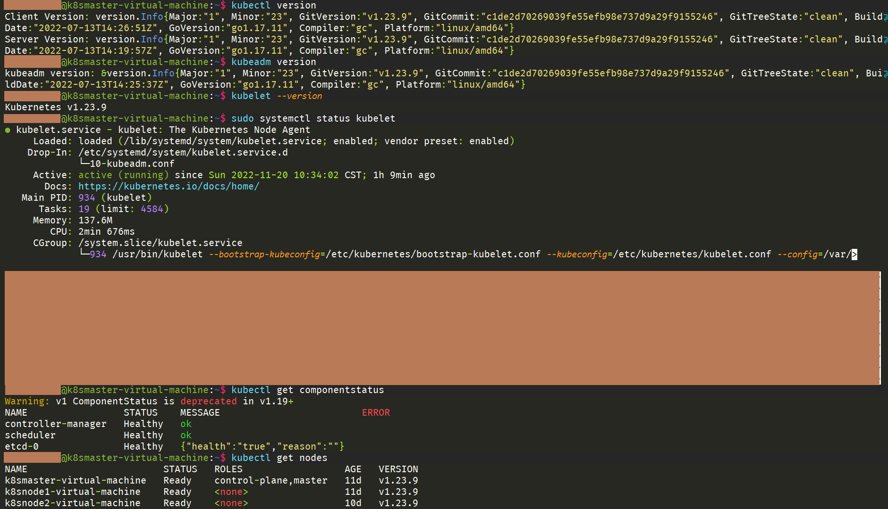
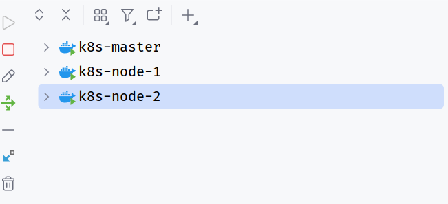

# 安装Kubernetes
该步骤适用于Kubernetes1.23.9以及Kubernetes1.19.0版本，不适用于1.24及以上版本，原因是：
>随着项目的增长，他们需要放弃他们的遗留功能以确保他们的未来。Dockershim 是 Kubernetes 的容器运行时，但它已被更好的 CRI 可插拔系统所取代。现在 Dockershim 已被移除，许多开发人员和集群管理员将不得不进行不方便但必要的迁移。
>https://sysdig.com/blog/kubernetes-1-24-whats-new/#2221

反正就是K8S移除了对Docker的默认支持，采取了更通用更灵活的CRI接口系统，这里因为生产环境下还是Docker作为运行时，所以就没用最新的去折腾了（嫌麻烦），直接用现成的1.23.9版本得了，不算旧，但也谈不上新。
操作系统使用了 `Ubuntu 22.04`。
## Kubernetes集群配置
这里我使用了3台虚拟机来搭建整个集群，一台作为Master Node，两台作为Worker Node，为了方便，可以在Master机器上完成下面所有步骤后，克隆出来两台Worker。如果想在一台机上进行一个All In One的操作，可以参考后面的ALL IN ONE章节。
### 基础配置
| 条目      | CPU配置 |内存配置|硬盘配置|
| ----------- | ----------- |----------|-------|
| k8smaster | 3核心  | 6G | 25G |
| k8snode1 | 2核心  | 3G | 25G |
| k8snode2 | 2核心  | 3G | 25G |

为了方便后面使用名称而不是记IP，所以进行IP表配置，表如下：
```
192.168.3.131 k8smaster-virtual-machine
192.168.3.132 k8snode1-virtual-machine
192.168.3.130 k8snode2-virtual-machine
```
接下来需要关闭操作系统的交换内存（Swap）功能，
```shell
sudo swapoff -a # 临时关闭
sudo vim /etc/fstab # 注释# /swapfile 一行
```
开启IP转发功能，
```shell
sudo vim /etc/sysctl.conf
# 打开这行功能 net.ipv4.ip_forward=1
sudo sysctl -p 
# 如果输出 net.ipv4.ip_forward=1 则证明修改成功了
```
### 安装Docker
1. 进行软件源升级和安装前置软件
```shell
sudo apt-get update
sudo apt-get -y install apt-transport-https ca-certificates curl software-properties-common
```
2. 安装GPG证书
```shell
curl -fsSL https://mirrors.aliyun.com/docker-ce/linux/ubuntu/gpg | sudo apt-key add -
```
4. 写入软件源
```bash
sudo add-apt-repository "deb [arch=amd64] https://mirrors.aliyun.com/docker-ce/linux/ubuntu $(lsb_release -cs) stable"
```
6. 获取软件源目录，并安装Docker
```shell
sudo apt-get -y update
sudo apt-get install -y docker-ce
```
8. 安装Docker-Compose
```bash
sudo apt-get install -y docker-compose
```
10. 配置用户组权限
```bash
sudo groupadd docker # 添加用户组
sudo gpasswd -a $USER docker # 将当前用户添加到 Docker 用户组中
newgrp docker
```
12. 设置Docker开机自启
```bash
sudo systemctl enable docker
```
14. 修改Docker的 `Cgroup` 驱动实现
```shell
sudo vim /etc/docker/daemon.json
# 添加如下内容
{
  "exec-opts": ["native.cgroupdriver=systemd"]
}
sudo systemctl daemon-reload && sudo systemctl restart docker 
# 修改完需要重启
```
13. 验证
```bash
docker info | grep "Cgroup Driver" 
# 检查驱动修改完成没有
# 如果显示Cgroup Driver: systemd，就是修改好了
docker version 
# 如果显示当前Docker版本信息就是安装完成啦！
```
### 安装K8S
安装之前，需要了解一件事，K8S的默认软件源因为网络原因是不方便访问的，所以我们这里使用国内的软件源镜像。
1. 添加证书
```shell
curl https://mirrors.aliyun.com/kubernetes/apt/doc/apt-key.gpg | sudo apt-key add - 
```
2. 添加软件源
```shell
sudo vim /etc/apt/sources.list.d/kubernetes.list
# 将下面内容添加到 kubernetes.list 文件中
deb https://mirrors.aliyun.com/kubernetes/apt/ kubernetes-xenial main
```
3. 列出可安装版本
```shell
sudo apt-get update
apt-cache madison kubelet
```
4. 安装指定版本（这里我们选择1.23.9，不选最新的和太旧的）
```shell
sudo apt-get install -y kubelet=1.23.9-00 kubeadm=1.23.9-00 kubectl=1.23.9-00
```
5. 设置开机自启并启动 `kubelet` 服务
```bash
sudo systemctl enable kubelet
sudo systemctl start kubelet
```
6. 在Master节点上进行初始化
```shell
sudo kubeadm init --kubernetes-version=v1.23.9 \
                     --pod-network-cidr=10.244.0.0/16 \
                     --service-cidr=10.96.0.0/12 \
                     --ignore-preflight-errors=Swap \
                     --image-repository=registry.aliyuncs.com/google_containers \
                     --v 5
# 需要注意的是，这里默认将要使用 calico 网络组件
```
7. 按照回显内容进行初始化
```shell
mkdir -p $HOME/.kube
sudo cp -i /etc/kubernetes/admin.conf $HOME/.kube/config
sudo chown $(id -u):$(id -g) $HOME/.kube/config
```
8. 添加网络插件
```shell
kubectl apply -f https://docs.projectcalico.org/manifests/calico.yaml
```
9. 在Master节点上建立 `join` 命令，让其他节点加入进来
```bash
# 其实这一步的的内容在上面初始化完成后，就已经得到了，但为了后面方便再次进行操作，所以记录下来
kubeadm token create --ttl 0  --print-join-command
# 拿到 join 命令，可以去 Worker 节点执行了，会自动加入进来，并由 Master 节点管理
```
10. 检查状态
```bash
# 检查 kubelet 版本是否一致
kubectl version
kubeadm version
kubelet --version
# 检查 kubelet 服务
sudo systemctl status kubelet
# 检查本机上所有组件是否正确运行，如果全为 OK/Health 即可
kubectl get componentstatus
# 检查 Node 是否 Ready
kubectl get nodes
```
如果一切如下所示，那么说明K8S安装完成啦！

# 在K8S集群环境中部署JavaWeb服务
## 开发简单JavaWeb服务镜像
### 目录状况
```bash
D:.  
└─src  
   ├─docker  
   │      Dockerfile  
   │  
   ├─kubernetes  
   │  │  commands.md  
   │  └─k8s-config-helloworld.yaml  
   │  
   └─main  
     ├─java  
     │  └─com  
     │      └─example  
     │          └─demo  
     │              └─k8s  
     │                  │  K8sApplication.java  
     │                  │  
     │                  └─controller  
     │                          HelloWorldController.java  
     │  
     └─resources  
         └─application.properties
```
对于JavaWeb项目而言，就是一个简单的Restful服务，其内容就是获取一下当前App的ID，这个待会儿会用，然后附带该软件部署在哪台机器上的哪个用户名下启动的。
```java
@RestController  
public class HelloWorldController {  
    private static final String ID;  
  
    static {  
        ID = UUID.randomUUID().toString();  
    }  
  
    @GetMapping("/")  
    public String helloWorld() throws UnknownHostException {  
        String username = System.getProperty("user.name");  
        String hostname = InetAddress.getLocalHost().getHostName();  
        return "ID: " + ID + " hello, world!, properties: " + username + "@" + hostname;  
    }  
}
```
测试一下：
```bash
curl -X GET http://localhost:8080/
ID: e0d3c26a-0b9c-48a4-a5e7-3647271c4942 hello, world!, properties: ***@***
```
本地测试完成没有问题后，就需要对他进行打包成镜像，准备放到K8S集群环境中去部署。
### Dockerfile文件编写
这里仅仅配置必要的部分，没有进行更多的操作和步骤，编写完成后按照之前提到的目录树，放到指定未知
```dockerfile
# 镜像构建jdk版本，一定要大于等于当前编译的版本  
FROM openjdk:11  
MAINTAINER cherry  
# 修改工作目录  
WORKDIR /  
# 设置字符集，防止乱码  
ENV LANG=C.UTF-8 LC_ALL=C.UTF-8  
# 拷贝jar包到工作目录下  
COPY k8s-helloworld.jar k8s-helloworld.jar  
# 设定时区  
ENV TZ=Asia/Shanghai  
# 容器启动点  
ENTRYPOINT ["java", "-jar", "./k8s-helloworld.jar"]  
# 容器对外暴露8080端口  
EXPOSE 8080
```
### 配置Docker
为了安全起见，Docker默认情况下是不允许本机以外的客户端访问Docker的控制API。但是这里都是在自己机器上的内网环境，所以没啥安不安全的，因此进行下面的配置，让maven插件能更方便的访问。
```bash
sudo vim /usr/lib/systemd/system/docker.service
# 修改成下面这种
[Service]
...
containerd=/run/containerd/containerd.sock -H tcp://0.0.0.0:2375
...
```
这样就可以在外部，包括IDEA里面访问。

### 配置Maven插件，帮忙打包
其实主要配置的一个是软件名，这里是 `k8s-helloworld`，一定要和 `Dockerfile` 文件里的可执行文件名一致才可以。
```xml
<build>  
   <finalName>k8s-helloworld</finalName>    
      <!-- 打包Docker的插件 -->  
      <plugin>  
         <groupId>com.spotify</groupId>  
         <artifactId>docker-maven-plugin</artifactId>  
         <version>1.0.0</version>  
         <configuration>  
            <!-- 镜像名称 -->  
            <imageName>${project.name}-docker</imageName>  
            <!-- Dockerfile 位置-->  
            <dockerDirectory>${basedir}/src/docker</dockerDirectory>  
            <!-- 镜像标签 -->  
            <imageTags>  
               <imageTag>${project.version}</imageTag>  
            </imageTags>  
            <!-- Docker 位置 -->  
            <dockerHost>http://192.168.3.130:2375</dockerHost>  
            <resources>  
               <resource>  
                  <targetPath>/</targetPath>  
                  <directory>${project.build.directory}</directory>  
                  <!--用于指定需要复制的文件 需要包含的 jar包 ，这里对应的是 Dockerfile中添加的文件名　-->  
                  <include>${project.build.finalName}.jar</include>  
               </resource>  
            </resources>  
         </configuration>  
         <!-- 将插件绑定到 maven 的某个阶段进行 -->  
         <executions>  
            <execution>  
               <id>build-image</id>  
               <!-- 只要 package 一下，就会进行 mvn docker:build-->               <phase>package</phase>  
               <goals>  
                  <goal>build</goal>  
               </goals>  
            </execution>  
         </executions>  
         <!-- 对于JDK11 之后的版本而言，需要这个依赖 -->  
         <dependencies>  
            <dependency>  
               <groupId>javax.activation</groupId>  
               <artifactId>activation</artifactId>  
               <version>1.1.1</version>  
            </dependency>  
         </dependencies>  
      </plugin>  
   </plugins>  
</build>
```
配置完成后，进行 `mvn clean package` 打包，会自动在 `package` 流程中把镜像推到配置的 Docker  仓库中去
```bash
docker images
REPOSITORY                                           TAG                       IMAGE ID       CREATED         SIZE
k8s-docker                                           0.0.1-SNAPSHOT            9a39587312ae   5 seconds ago   676MB
k8s-docker                                           latest                    9a39587312ae   5 seconds ago   676MB
```
### 测试镜像是否能正常工作
如果对自己的镜像不放心，可以先创建一个容器进行测试，首先到任意Worker节点上，创建容器
```bash
docker run -p 8888:8080 --name hello k8s-docker:latest
```
这里让它以前台方式运行，是为了方便查看启动日志，然后进行HTTP请求，查看是否正常
```bash
curl -X GET http://192.168.3.132:8888/
ID: 56ceb182-e731-463b-a80e-c5fffac1c8b8 hello, world!, properties: root@3fa241c5ceab
```
这里的 `用户@主机` 是从容器中获取的，所以后面的主机名是容器ID。
## 编写Kubernetes资源配置文件
### `Deployment` 资源配置
```yaml
# hello-deployment.yaml
apiVersion: apps/v1  
kind: Deployment  
metadata:  
  name: k8s-hello-world  
spec:  
  replicas: 3  
  selector:  
    matchLabels:  
      app: k8s-hello-world  
  template:  
    metadata:  
      labels:  
        app: k8s-hello-world  
    spec:  
      containers:  
        - name: k8s-hello-world  
          image: k8s-docker:0.0.1-SNAPSHOT  
          imagePullPolicy: Never  # 不要从远程仓库拉取  
          ports:  
            - name: http  
              containerPort: 8080 # 此处定义POD暴露的端口
```
### `Service` 资源配置
```yaml
apiVersion: v1  
kind: Service  
metadata:  
  name: k8s-hello-world  
  labels:  
    app: k8s-hello-world  
spec:  
  type: NodePort      # 更改成 NodePort 类型，让Node外部有访问能力  
  ports:  
    - name: http  
      port: 8080  
      nodePort: 30888 # 此处定义POD的端口8080映射为Node的8888  
  selector:  
    app: k8s-hello-world
```
将这俩文件放到Kubernetes的Master节点上去
```bash
scp ./hello-deployment.yaml k8s-master@192.168.3.131:~/hello-k8s/
scp ./hello-service.yaml k8s-master@192.168.3.131:~/hello-k8s/
```
然后在Kubernetes中进行部署
```bash
kubectl apply -f ./hello-deployment.yaml
kubectl apply -f ./hello-service.yaml
```
检查各个资源健康状况
```bash
kubectl get pods
NAME                               READY   STATUS    RESTARTS   AGE
k8s-hello-world-6686895cb5-kwp5r   1/1     Running   0          15m
k8s-hello-world-6686895cb5-mddxx   1/1     Running   0          15m
k8s-hello-world-6686895cb5-mmh7k   1/1     Running   0          15m

kubectl get deployment
NAME              READY   UP-TO-DATE   AVAILABLE   AGE
k8s-hello-world   3/3     3            3           16m
# 可以看到有三个实例Pod，对应于deployment中的三个副本

kubectl get svc 
NAME              TYPE        CLUSTER-IP       EXTERNAL-IP   PORT(S)          AGE
k8s-hello-world   NodePort    10.102.140.157   <none>        8080:30888/TCP   12m
kubernetes        ClusterIP   10.96.0.1        <none>        443/TCP          11d
```
一切都完成后，可以到集群外进行验证：
```bash
curl -X GET http://192.168.3.131:30888/
ID: c2a89ecc-df40-457c-a971-91eab13ec8fc hello, world!, properties: root@k8s-hello-world-6686895cb5-mddxx
```
可以看到，该请求完成了响应，并且拿到了正确的返回值。
至此，整套环境的配置和验证已经完成，可以根据需求进行开发和部署了，但是之前留下来的一个小小的疑问：
上面在 `Deployment` 资源中，声明了 `replicas=3`，也就是说存在三个实例，而这三个实例在处理用户请求时，根据Kubernetes的说明，应该是均衡负载的，所以这里进行一个简单的测试。
发起600个HTTP请求，看看每个节点能够处理多少任务，如果任务数量相近，那么说明真的完成了负载均衡。
```python
import requests  
  
  
def func():  
	# 统计并打印
    url = "http://192.168.3.131:30888"  
    count = dict()  
    for i in range(0, 600):  
        res = requests.get(url)  
        host = res.text.split("@")[1]  
        if count.__contains__(host):  
            count[host] = count.__getitem__(host) + 1  
        else:  
            count[host] = 1  
    print(count)  
  
  
if __name__ == '__main__':  
    func()
```
测试结果如下：
```bash
python.exe main.py

{'k8s-hello-world-7446445cb5-mddxx': 189, 'k8s-hello-world-7446445cb5-kwp5r': 198, 'k8s-hello-world-7446445cb5-mmh7k': 213}
```
可以看出来，确实是均衡负载的😉。之后可以对每个Pod的计算资源进行限制，看看是否能完成更复杂的负载均衡。
# ALL IN ONE
虽然集群式的Kubernetes是最常用的用法，而且Master节点默认是不分配工作负载的，但偶尔需要来一个ALL IN ONE的用法，让Master节点也作为一个可工作节点来进行资源分配，这样就不需要多个设备了。
具体的是，在使用 `kubeadm` 初始化完成后，直接在Master节点上执行下面命令：
```bash
kubectl taint nodes --all node-role.kubernetes.io/master-
```
此时Master节点也会被分配工作负载了，也就不需要额外的节点加入才能使用Kubernetes了。

---
❤